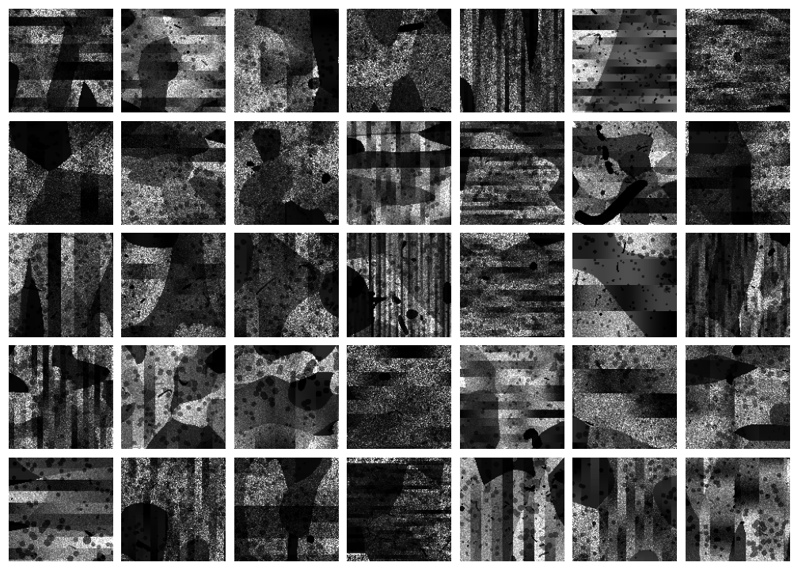

# oct_vesselseg

This repository contains an implementation of computational geometry and domain randomization for synthesizing vascular structures and Optical Coherence Tomography (OCT) data. The project is inspired by the concepts and methodologies described in the [SynthSeg](https://github.com/BBillot/SynthSeg) project, adapted to the domain of vascular imaging.

# Table of Contents

- [Introduction](#introduction)
- [Getting Started](#getting-started)
    - [Installation](#installation)
    - [Configuration](#configuration)
- [Usage](#usage)
    - [Vessel Synthesis](#vessel-synthesis)
    - [OCT Image Synthesis](#image-synthesis)
    - [Training](#training)
    - [Inference](#inference)
- [Results](#results)
- [License](#license)
- [Acknowledgements](#acknowledgements)

# Introduction

This project focuses on generating synthetic datasets for training a 3D U-Net for the task of vasculature segmentation in OCT data. Using a cubic spline synthesis pipeline first established in [SynthSpline](https://github.com/balbasty/synthspline), and many data augmentation techniques from [Cornucopia](https://github.com/balbasty/cornucopia) this project employs domain-randomized synthesis to create structured labels, textures, and artifacts, enhancing the training of neural networks for vascular segmentation.


# Getting Started
Hard requirements include `Cppyy~=2.3` and `Python~=3.9`

## Installation

Create and activate a new mamba environment with python 3.9

```bash
mamba create -n oct_tissuemasking python=3.9
mamba activate oct_tissuemasking
```

Install synthspline for vasculature synthesis

```bash
pip install git+https://github.com/balbasty/synthspline.git#f78ba23
```

We need to identify and set our cuda version to make sure we install the right prebuilt wheel for cupy. You can find your cuda version by running the command `nvcc --version`.

```bash
export CUDA_VERSION=<cuda-version>
```

Finally, we can install oct_tissuemasking (this might take a while so let's set the default timeout to 20,000 seconds).

```bash
pip install oct_tissuemasking --default-timeout=20000
```

## Configuration

Identify the directory you want all oct_vesselseg related files to go into (you might need to make a new directory), and run the following command. This will add a line to your ~/.bashrc file to set a global environment variable `OCT_VESSELSEG_BASE_DIR`. I recommend this to be an empty directory (or if you specify a non-existent directory, one will be made for you).

```bash
oct_vesselsynth configure
```

# Usage

## Vessel Synthesis

Synthesize the vascular labels for training. You can get help for this command with the `--help` flag. The labels will go into the `OCT_VESSELSEG_BASE_DIR` directory in the subdirectory called `synthetic_data`.

```bash
oct_vesselseg vesselsynth
```

## OCT Image Synthesis

Synthesize some examples of synthetic OCT images.

```bash
oct_vesselseg imagesynth
```

## Training

Train the model on the vessel labels and on-the-fly OCT image synthesis. The models will go into a subdirectory of `OCT_VESSELSEG_BASE_DIR` called `models`.

```bash
oct_vesselseg train
```

## Inference

Run inference on a compatable NIfTI file. Th

```bash
oct_vesselseg test --in-path <path-to-NIfTI>
```

# Results

Here we provide some examples of synthetic vasculature generated by this method:



# License

This project is licensed under the MIT License - see the LICENSE file for details.

# Acknowledgements

- [SynthSeg](https://github.com/BBillot/SynthSeg), [SynthSpline](https://github.com/balbasty/synthspline), and [Cornucopia](https://github.com/balbasty/cornucopia), for the inspiration and methodological foundation.
- Much of the computation resources required for this research was performed on computational hardware generously provided by the [Massachusetts Life Sciences Center](https://www.masslifesciences.com/).