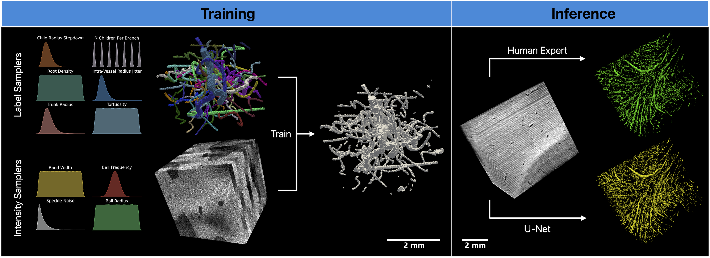
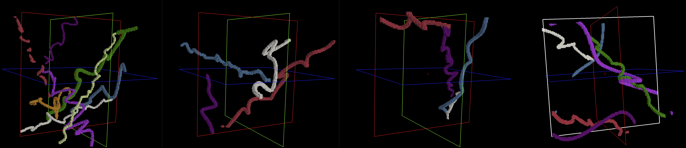
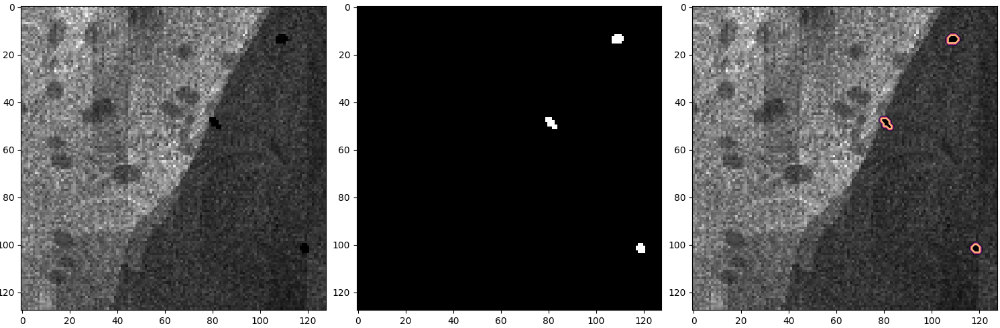

# oct_vesselseg

Characterized by minimal priors and high variance sampling, this project builds on the emerging field of synthesis-based training by proposing an entirely data-free synthesis engine for training a Unet in the task of vascular labeling in sOCT data (mus modality). This project employs domain-randomized synthesis to create structured vessel and neural parenchyma labels, textures, and artifacts. It creates volumetric imaging data *similar* to, but not emulative of 3D sOCT data, with corresponding (perfect) ground truth labels for vasculature. The package contains a training module employing an on-the-fly image synthesis procedure to create a virtually infinite number of unique volumetric training data.

# Table of Contents

- [1 Introduction](#1-introduction)
- [2 Getting Started](#2-getting-started)
    - [2.1 Installation](#21-installation)
    - [2.2 Configuration](#22-configuration)
- [3 Usage](#3-usage)
    - [3.1 Vessel Synthesis 🛠️](#31-vessel-synthesis)
        - [3.1.1 Basic Usage](#311-basic-usage)
        - [3.1.2 Customizing the Vessel Label Synthesis Engine](#312-customizing-the-vessel-label-synthesis-engine)
        - [3.1.3 Example Usage](#313-example-usage)
        - [3.1.4 Example Output](#314-example-output)
    - [3.2 OCT Image Synthesis 📸](#32-oct-image-synthesis)
        - [3.2.1 Basic Usage](#321-basic-usage)
        - [3.2.2 Customizing the Image Synthesis Engine](#322-customizing-the-image-synthesis-engine)
        - [3.2.3 Example Usage](#323-example-usage)
        - [3.2.4 Example Output](#324-example-output)
    - [3.3 Training 🏋🏻‍♀️](#33-training)
        - [3.3.1 Basic Usage](#331-basic-usage)
        - [3.3.2 Customizing the Training Process](#332-customizing-the-training-process)
        - [3.3.3 Example Usage](#333-example-usage)
        - [3.3.4 Example Output](#334-example-output)
    - [3.4 Inference 🕵🏽](#34-inference)
        - [3.4.1 Basic Usage](#341-basic-usage)
        - [3.4.2 Customizing Inference](#342-customizing-inference)
        - [3.4.3 Example Usage](#343-example-usage)
        - [3.4.4 Example Output](#344-example-output)
- [4 Results](#4-results)
- [License](#license)
- [Acknowledgements](#acknowledgements)

# 1 Introduction

This project focuses on generating synthetic datasets for training a 3D U-Net in the task of vasculature segmentation in OCT data. Using a cubic spline synthesis pipeline first established in [SynthSpline](https://github.com/balbasty/synthspline), and many data augmentation techniques from [Cornucopia](https://github.com/balbasty/cornucopia), this project employs domain-randomized synthesis to create structured labels, textures, and artifacts, enhancing the training of neural networks for vascular segmentation.

## Check out our papers!

📜 July 2024: [Journal Article Preprint](https://arxiv.org/abs/2407.01419v1)

📜 April 2024: [Conference/Short paper from Medical Imaging with Deep Learning Conference](https://openreview.net/forum?id=j8v7qc5bof&referrer=%5Bthe%20profile%20of%20Etienne%20Chollet%5D(%2Fprofile%3Fid%3D~Etienne_Chollet1))



# 2 Getting Started

Hard requirements include `Cppyy~=2.3` and `Python~=3.9`

## 2.1 Installation

It is suggested that you create and activate a new mamba environment with python 3.9. You can learn how to install mamba by following the instructions provided in the [Miniforge repo](https://github.com/conda-forge/miniforge).

```bash
mamba create -n oct_vesselseg python=3.9
mamba activate oct_vesselseg
```

In order to synthesize vascular labels from splines, we will need to install the code from the synthspline repo.

```bash
pip install git+https://github.com/balbasty/synthspline.git#f78ba23
```

We need to identify and set our cuda version to make sure we install the right prebuilt wheel for cupy. You can find your cuda version by running the command `nvcc --version` or `nvidia-smi`. If you choose the latter, the cuda version will appear in the upper right hand corner of the output.

```bash
export CUDA_VERSION=<cuda-version>  # OR nvidia-smi
```

Finally, we can install oct_vesselseg from pypi.

```bash
pip install oct_vesselseg
```

### Optional installation
Optionally (reccomended), you may install [freesurfer](https://surfer.nmr.mgh.harvard.edu/fswiki/DownloadAndInstall) to take advantage of freeview's NIfTI visualization tools. This helps in visualizing the output of each step, and the final results of the prediction.

## 2.2 Configuration

You first need to determine the directory you want all oct_vesselseg related files to be stored. *PLEASE ENSURE IT IS A FULL (ABSOLUTE) PATH*. This directory is reccommended to be empty, or if you specify a non-existent directory, one will be created for you.

After determining this path, run the configuration subcommand of the recently installed `oct_vesselseg` package without any arguments (bare). Once run, you will receive a prompt to input the path. This subcommand adds a line to your ~/.bashrc file, which sets a global environment variable `OCT_VESSELSEG_BASE_DIR` to the desired path.

```bash
oct_vesselseg configure
```

After configuring `oct_vesselseg`, you may proceed to the usage section (below).

# 3 Usage

## 3.1 Vessel Synthesis

The `vesselsynth` command is used to generate synthetic vascular labels that may be used, in conjunction with artifact and noise models, to train a 3D U-Net. These labels will be saved in the `synthetic_data` directory within `OCT_VESSELSEG_BASE_DIR`. This engine uses cubic splines and randomized domain-specific parameters to create highly variable yet structured vascular geometries.

### 3.1.1 Basic Usage

To generate a synthetic vascular dataset with default parameters, use:

```bash
oct_vesselseg vesselsynth
```

There are many different parameters you can specify with this command using these flags:

### 3.1.2 Customizing the Vessel Label Synthesis Engine

You can customize the vessel label synthesis engine with several flags, each corresponding to a specific aspect of the geometry of the volume generated, a single vascular tree, or individual branches. Below is a summary of some of the most important flags

- `--shape`: This is the shape of the volume (input data) to be synthesized. This does not need to be a perfect cube. This will also be the shape of the UNet you will train.
- `--voxel-size`: This is the spatial resolution of the data to be synthesized measured in units of $\frac{mm^3}{voxel}$. The default value is $0.02 \frac{mm^3}{voxel}$.
- `--tree-levels`: Sampler bounds for the number of hierarchical levels in the vascular tree. The level of a branch in a vascular tree refers to the distance (in terms of number of branches) from the root node to the node from which the branch in question originates. This quantity is sampled from a discrete uniform distribution for each tree that is created.
    - Root Branch (level 0): The root branch is at level 0.
    - First Branch (level 1): The children of the root branch are at level 1.
    - Second level (level 2): The grandchildren of the root are at level 2.
- `--tree-density`: Sampler bounds for the number of trees (or root points) per volume in units of $\frac{trees}{mm^3}$. This quantity is sampled from a uniform distribution for each volume that is created.
- `--tree-root-radius`: Sampler bounds for the radius of the first branch (root, Level 0). This quantity is sampled from a uniform distribution for each tree that is created.
- `--branch-tortuosity`: Sampler bounds for the tortuosity of a given branch. This quantity is sampled from a uniform distribution for each branch that is created. Tortuosity is defined as such:
    - $tortuosity = \frac{cord}{length}$
- `--branch-radius-ratio`: Sampler bounds for the ratio of the radius of the child branch compared to the radius of the parent branch. This is sampled from a uniform distribution for each child branch that is created.
- `--branch-radius-change`: Sampler bounds for a multiplicative variation in radius along the legth of a vessel. This is sampled from a uniform distribution for each branch.
- `--branch-children`: Sampler bounds for the number of children per parent. This is sampled from a discrete uniform distribution for each parent branch.

### 3.1.3 Example Usage

To generate 50 sample dataset with data of shape (128, 128, 128) voxels, a resolution of 0.1 $\frac{mm^3}{voxel}$, and highly tortuous vessels (among other modifications):

```bash
oct_vesselseg vesselsynth --data-experiment-n 2 --shape 128 128 128 --n-samples 50 --voxel-size 0.1 --tree-levels 1 2 --tree-density 0.001 0.002 --branch-tortuosity 4.0 5.0 --branch-children 1 2
```

### 3.1.4 Example Output
The vesselsynth subcommand will save its output in the umbrella directory `$OCT_VESSELSEG_BASE_DIR/synthetic_data`. Within this directory, locate the experiment number you specified using the `--data-experiment-n` flag. If you didn't specify this, your data was saved to experiment 1 (`exp0001`). This directory is home to myriad volumetric labels, but we are only concerned with those of the form `*_vessels_label.nii.gz`. The data are numbered in the order they were synthesized. Each datum is a seperate instance of a set of volumetric vessel labels - each single branch within a vascular tree is represented by a unique label, numbered from 1 to n. Let's use freeview to look at number 32, for example:

```bash
freeview $OCT_VESSELSEG_BASE_DIR/synthetic_data/exp0001/0032_vessels_label.nii.gz
```

Using the vertical side pannel on the left, set `Color Map` to `Lookup Table`, switch to 3d view, and check the box at the bottom of the pannel `Show as isosurface in 3D view`. Here are a few samples of the 3D renderings of vascular labels.



## 3.2 OCT Image Synthesis

The `imagesynth` command generates synthetic OCT images which are made on-the-fly during the training process. By saving them to `$OCT_VESSELSEG_BASE_DIR/synthetic_data/exp000*/sample_vols` with this command, this allows us to visualize our desired noise and artifact parameters before using them to train the network.

### 3.2.1 Basic Usage

To generate OCT images with default settings, run:

```bash
oct_vesselseg imagesynth
```

### 3.2.2 Customizing the Image Synthesis Engine

You can customize the synthesis process using the following parameter flags:

- `--data-experiment-n`: Specifies the vesselsynth data experiment number for loading volumetric dat.
- `--n-samples`: The number of synthetic OCT images to generate.
- `--parenchyma-classes`: The upper bound for the number of classes of parenchyma (neural tissue) in the image synthesis.
- `--parenchyma-shape`: The upper bound for the number of control points defining the shape of each parenchyma class.
- `--vessel-intensity`: The bounds for the attenuation of the vessel intensities when blending them onto the parenchyma. Lower magnitude results in vessels that are darker than their surrounding tissue/background. 
- `--vessel-texture`: Optionally apply intra-vascular textures and artifacts.
- `--image-gamma`: The bounds for non-linear contrast adjustment. Higher values increase contrast, while lower values decrease it.
- `--image-z-decay`: The upper bound for z decay, roughly approximating the banding artifact due to serial sectioning.
- `--image-speckle`: The bounds for speckle noise parameters.
- `--image-spheres`: Whether to add spherical artifacts to the image.
- `--image-banding`: Optionally to apply slabwise banding (z-decay) artifacts to the image.
- `--image-dc-offset`: Optionally add a small DC offset to the parenchyma tensor.

### 3.2.3 Example Usage

Here's how you might use the `imagesynth` command to turn 20 vascular labels into volumes with 7 classes (distinct intensities) of neural parenchyma, vessels that are much darker than the background tissue, and with low overall contrast:

```bash
oct_vesselseg imagesynth --n-samples 20 --parenchyma-classes 7 --vessel-intensity 0.1 0.2 --image-gamma 0.5 0.75
```

### 3.2.4 Example Output

The imagesynth subcommand will save its output in the umbrella directory `$OCT_VESSELSEG_BASE_DIR/synthetic_data`. Within this directory, locate the experiment number you specified using the `--data-experiment-n` flag in vesselsynth. For experiment 1, there will be two subdirectories of `$OCT_VESSELSEG_BASE_DIR/synthetic_data/exp0001/sample_vols`:
- `$OCT_VESSELSEG_BASE_DIR/synthetic_data/exp0001/sample_vols/figures`: Contains `.png` files with a random cross section of the 3D synthesized volumetric image, its corresponding vascular labels (binary), and the labels overlaid atop the intensity image.
- `$OCT_VESSELSEG_BASE_DIR/synthetic_data/exp0001/sample_vols/niftis`: Contains the volumetric image data and the corresponding (binary) vascular label map. You can load these into freeview.

Let's take a look at one of the png images. I will look at `$OCT_VESSELSEG_BASE_DIR/synthetic_data/exp0001/sample_vols/figures/volume-0004.png`



## 3.3 Training

### 3.3.1 Basic Usage

Train the model on the vessel labels and on-the-fly OCT image synthesis. The models will go into a subdirectory of `OCT_VESSELSEG_BASE_DIR` called `models`.

```bash
oct_vesselseg train
```

### 3.3.2 Customizing the Training Process

You can customize the training process using the following groups of parameter flags:

#### Model Flags

The following flags allow you to specify parameters regarding the model's architecture, directory name, and the experimental version:

- `--model-version-n`: Specifies the version number of the model to train. This will represent its own subdirectory within the directory specified by the following flag.
- `--model-dir`: String that specifies the directory where all model versions/experimental runs are stored.
- `--model-levels`: Number of levels (encoding/decoding block pairs) of the model.
- `--model-features`: List of integers defining the number of features in each corresponding layer of the model.

#### Training Flags

The following flags define parameters regarding the training procedure:

- `--training-lr`: Global learning rate that will be used for the majority of training (after lr warmup and before lr cooldown)
- `--training-train-to-val`: Float representing the ratio of training data samples to testing data samples (train:test).
- `--training-steps`: Number of times to step the optimizer (update the model's parameters) based on gradients calculated in backward pass.
- `--training-batch-size`: Number of samples per batch.

#### Data Flags

The following flags set specific parameters regarding the on-the-fly synthesis engine

- `--synth-data-experiment-n`: Specifies the vesselsynth data experiment number for loading volumetric dat.
- `--synth-samples`: Total number of synthetic OCT image samples to generate per epoch (late split into train and validation sets based on `--training-train-to-val` flag).
- `--synth-parenchyma-classes`: The upper bound for the number of classes of parenchyma (neural tissue) in the image synthesis.
- `--synth-parenchyma-shape`: The upper bound for the number of control points defining the shape of each parenchyma class.
- `--synth-image-gamma`: Bounds for global gamma exponential factor for contrast shrinking/stretching.
- `--synth-image-z-decay`: The upper bound for size of z decay, roughly approximating the banding artifact due to serial sectioning.
- `--synth-image-speckle`: Mean and standard deviation of multiplicative gamma noise.
- `--synth-image-spheres`: Whether to add spherical artifacts to the image.
- `--image-banding`: Optionally to apply slabwise banding (z-decay) artifacts to the image.
- `--image-dc-offset`: Optionally add a small DC offset to the parenchyma tensor.

### 3.3.3. Example Usage

Here's how you might use the `train` command to train on small model on 40 vascular labels and validate on 10 (using a train to validation ratio of 0.8):

```bash
oct_vesselseg train --synth-samples 50 --synth-parenchyma-classes 7 --model-levels 3 --model-features 8 16 32
```

### 3.3.4 Example Output

## 3.4 Inference

### 3.4.1 Basic Usage

Run inference on a compatable NIfTI file.

```bash
oct_vesselseg test --in-path <path-to-NIfTI>
```

### 3.4.2 Customizing Inference

- `--in-path`: Path to the stitched OCT data in compatable NIfTI format (`*.nii`). Can test on many different input files by seperating paths with commas.
- `--model-version-n`: Version number of the model to test.
- `--model-dir`: String that specifies the directory where all model versions/experimental runs are stored.
- `--patch-size`: Size of patches (and size of the training data that this model was trained on/input layer to the model).
- `--redundancy`: Factor controlling the overlap between adjacent patches. A value of 1 results in no overlap, a value of 2 results in 50% overlap in each dimension (8x averaging), and a value of 3 results in 75% overlap in each dimension (64x averaging)
- `--checkpoint`: Which checkpoint to load weights from. If 'best', the checkpoint resulting in the best validation accuracy will be used. If 'last', the checkpoint from the most recent epoch will be used.
- `--padding-method`: Method to pad the input tensor. {'reflect', 'replicate', 'constant'} .
- `--normalize-patches`: Optionally normalize each patch before prediction, based on the quantiles of the patch.

### 3.4.3 Example Usage

Here's how I would predict on a particular datum stored locally as a `.nii`:

```bash
oct_vesselseg test --in-path /autofs/cluster/octdata2/users/epc28/data/CAA/caa22/occipital/caa22_occipital.nii --patch-size 32 --redundancy 3
```

### 3.4.4 Example Output

## 🎉 Congrats!! You're finished :)

# Results

# License

This project is licensed under the MIT License - see the LICENSE file for details.

# Acknowledgements

- [SynthSeg](https://github.com/BBillot/SynthSeg), [SynthSpline](https://github.com/balbasty/synthspline), and [Cornucopia](https://github.com/balbasty/cornucopia), for the inspiration and methodological foundation.
- Much of the computation resources required for this research was performed on computational hardware generously provided by the [Massachusetts Life Sciences Center](https://www.masslifesciences.com/).
